<!-- Every graphic is generated: edit profile/config.json + profile/projects.json, then `node profile/build.mjs` -->

  <a href="https://alfais.uk"></a>

  &nbsp;
  &nbsp;
  

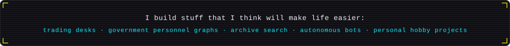


<table align="center" border="0" cellspacing="0" cellpadding="6">
  <tr>
    <td width="50%"><a href="https://github.com/Alfais1/antipode">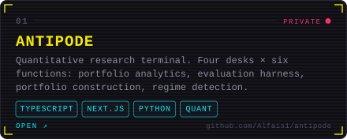</a></td>
    <td width="50%"><a href="https://github.com/Alfais1/wonk-demo">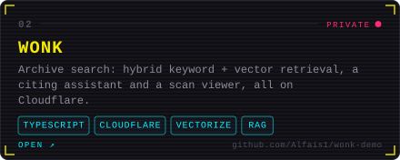</a></td>
  </tr>
  <tr>
    <td width="50%"><a href="https://github.com/Alfais1/gos">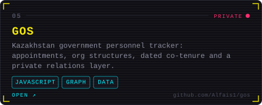</a></td>
    <td width="50%"><a href="https://deck.alfais.uk">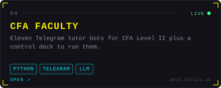</a></td>
  </tr>
  <tr>
    <td width="50%"><a href="https://github.com/Alfais1/hermes-trading-floor">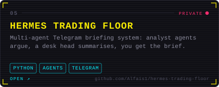</a></td>
    <td width="50%"><a href="https://github.com/Alfais1/sholu-dashboard">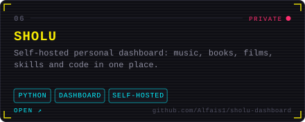</a></td>
  </tr>
  <tr>
    <td width="50%"><a href="https://github.com/Alfais1/relation">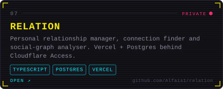</a></td>
    <td width="50%"><a href="https://github.com/Alfais1/coterie">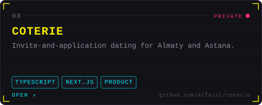</a></td>
  </tr>
</table>

  
More repositories

   
  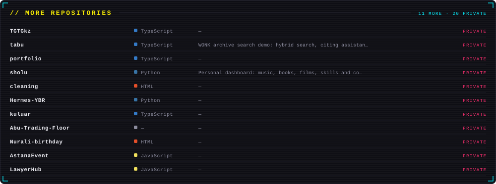

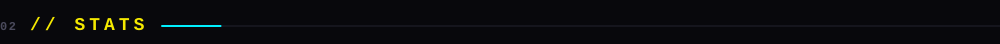

  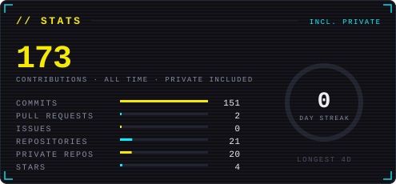
  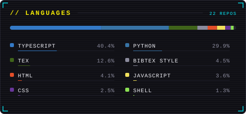

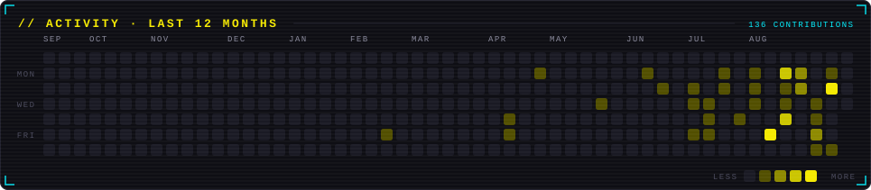

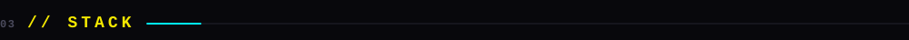

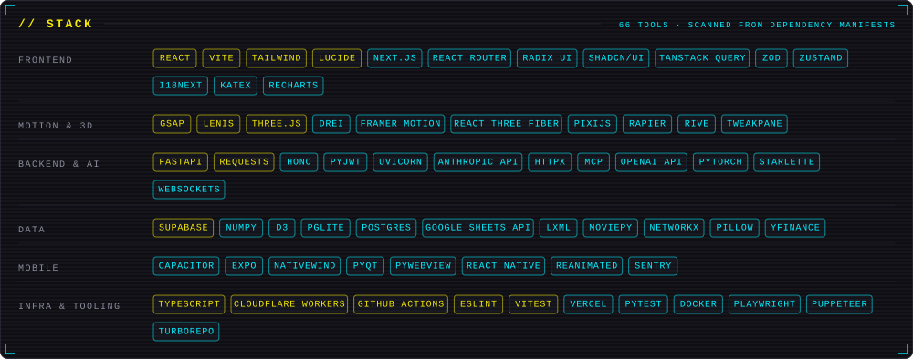

  
How this page is built

   

  Every graphic is an SVG generated by [`profile/build.mjs`](profile/build.mjs) from the GitHub GraphQL API, private repositories included.
  A [workflow](.github/workflows/build-profile.yml) re-renders them nightly, so the numbers, the heatmap and the streak stay current.
  Animation is SMIL and CSS inside the SVGs; no JavaScript, and nothing loaded from third parties except the three badges.
  Palette and copy live in [`profile/theme.mjs`](profile/theme.mjs) and [`profile/config.json`](profile/config.json).

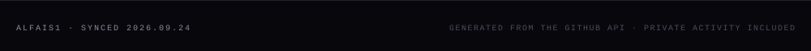
